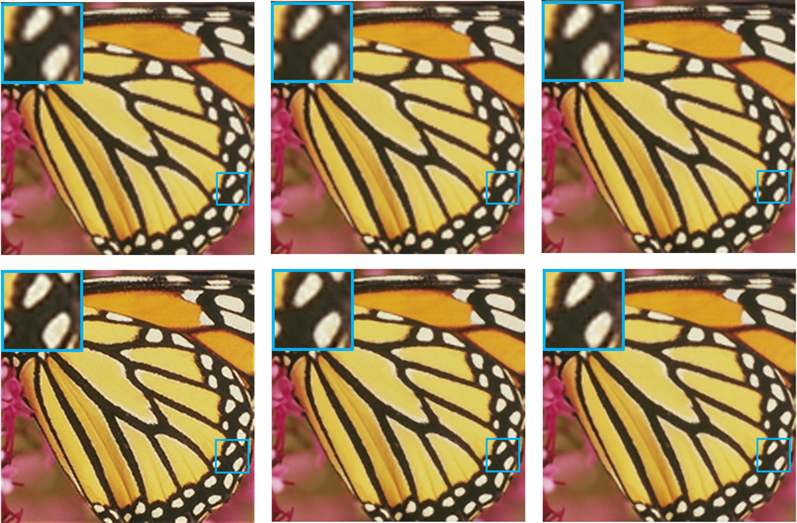

# [TensorFlow] Faster SRCNN

Implementation of FSRCNN model in **Accelerating the Super-Resolution Convolutional Neural Network** paper with Tensorflow 2x. 

Pytorch version: https://github.com/Nhat-Thanh/FSRCNN-Pytorch

I used Adam with optimize tuned hyperparameters instead of SGD + Momentum. 

I implemented 3 models, FSRCNN-x2, FSRCNN-x3, FSRCNN-x4.


## Contents
- [Train](#train)
- [Test](#test)
- [Demo](#demo)
- [Evaluate](#evaluate)
- [References](#references)


## Train
You run this command to begin the training:
```
python train.py  --steps=200000             \
                 --scale=2                  \
                 --batch_size=128           \
                 --save-best-only=0         \
                 --save-every=1000          \
                 --save-log=0               \
                 --ckpt-dir="checkpoint/x2" 
```
- **--save-best-only**: if it's equal to **0**, model weights will be saved every **save-every** steps.
- **--save-log**: if it's equal to **1**, **train loss, train metric, validation loss, validation metric** will be saved every **save-every** steps.


**NOTE**: if you want to re-train a new model, you should delete all files in sub-directories in **checkpoint** directory. Your checkpoint will be saved when above command finishs and can be used for the next times, so you can train a model on Google Colab without taking care of GPU time limit.

I trained 3 models on Google Colab in 200000 steps:
[](https://colab.research.google.com/github/Nhat-Thanh/FSRCNN-TF/blob/main/FSRCNN-TF.ipynb)

You can get the models here:
- [FSRCNN-x2.h5](checkpoint/x2/FSRCNN-x2.h5)
- [FSRCNN-x3.h5](checkpoint/x3/FSRCNN-x3.h5)
- [FSRCNN-x4.h5](checkpoint/x4/FSRCNN-x4.h5)

## Test
I use **Set5** as the test set. After Training, you can test models with scale factors **x2, x3, x4**, the result is calculated by compute average PSNR of all images.
```
python test.py --scale=2 --ckpt-path="default"
```
- **--ckpt-path="default"** means you are using default model path, aka **checkpoint/x{scale}/FSRCNN-x{scale}.h5**. If you want to use your trained model, you can pass yours to **--ckpt-path**.

## Demo 
After Training, you can test models with this command, the result is the **sr.png**.
```
python demo.py --image-path="dataset/test2.png" \
               --ckpt-path="default"            \
               --scale=2
```
- **--ckpt-path** is the same as in [Test](#test)

## Evaluate

I evaluated models with Set5, Set14, BSD100 and Urban100 dataset by PSNR. I use Set5's Butterfly to show my result:

<div align="center">

|   Model   |   Set5  |  Set14  | BSD100  | Urban100 |
|:---------:|:-------:|:-------:|:-------:|:--------:|
| FSRCNN-x2 | 37.7191 | 34.0454 | 33.9893 |	31.3276  |
| FSRCNN-x3 | 34.6114 |	31.2628 | 31.3051 | X |
| FSRCNN-x4 | 31.8877 | 29.2617 | 29.5976 |	26.9266  |

  <br/>

  <br/>
  <b>Bicubic x2-x3-x4 (top), FSRCNN x2-x3-x4 (bottom).</b>
</div>

## References
- Accelerating the Super-Resolution Convolutional Neural Network: https://arxiv.org/abs/1608.00367
- T91, General100: http://vllab.ucmerced.edu/wlai24/LapSRN/results/SR_training_datasets.zip
- Set5: https://filebox.ece.vt.edu/~jbhuang/project/selfexsr/Set5_SR.zip
- Set14: https://filebox.ece.vt.edu/~jbhuang/project/selfexsr/Set14_SR.zip
- BSD100: https://filebox.ece.vt.edu/~jbhuang/project/selfexsr/BSD100_SR.zip
- Urban100: https://filebox.ece.vt.edu/~jbhuang/project/selfexsr/Urban100_SR.zip
